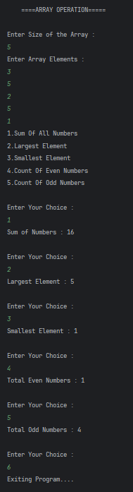

# Array Operations Menu Program

A simple Java console program that performs basic array operations such as sum, maximum, minimum, and counting even/odd numbers using user input.

---

## 📂 Files
- `Main.java`

---

## 🧠 Concept Used
- Array initialization and traversal  
- Conditional statements (`if`, `switch`)  
- Looping constructs (`for`, `while`)  
- Running answer technique (sum / max / min)  
- Basic input handling using `Scanner`  

---

## 📸 Screenshot

---

## 👨‍💻 Author
**Sujal Patil**  
📧 Email: sujalpatil21@gmail.com  
🌐 GitHub: [SujalPatil21](https://github.com/SujalPatil21)
