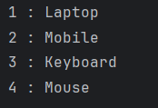
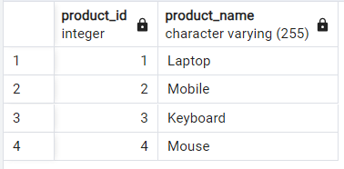

# PostgreSQL Data Fetch Using JDBC
A simple Java program that connects to a PostgreSQL database using JDBC and retrieves records from the `product` table.

---

## 📂 Files
- `Main.java`

---

## 🧠 Concept Used
- JDBC (Java Database Connectivity)
- PostgreSQL relational database
- Database connection using `DriverManager`
- SQL `SELECT` query execution
- `Statement` and `ResultSet` usage
- Iterating database records in Java
- Proper resource cleanup (`close()`)

---

## 📸 Screenshot
  

---

## 👨‍💻 Author
**Sujal Patil**  
📧 Email: sujalpatil21@gmail.com  
🌐 GitHub: [SujalPatil21](https://github.com/SujalPatil21)

