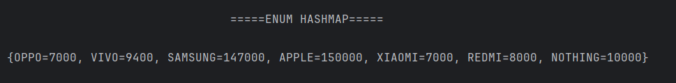

# EnumMap Mobile Price Mapping
A simple Java program that uses **EnumMap** and **Enums** to store and display mobile phone prices.

---

## 📂 Files
- `Mobile.java`
- `Main.java`

---

## 🧠 Concept Used
- `enum` for fixed constant values  
- `EnumMap` for efficient key-value mapping with enums  
- Iterating over map entries  
- Accessing nested enums (`Mobile.Phone`)

---

## 📸 Screenshot

---

## 👨‍💻 Author
**Sujal Patil**  
📧 Email: sujalpatil21@gmail.com  
🌐 GitHub: [SujalPatil21](https://github.com/SujalPatil21)
# EnumMap Mobile Price Mapping
A simple Java program that uses **EnumMap** and **Enums** to store and display mobile phone prices.

---

## 📂 Files
- `Mobile.java`
- `Main.java`

---

## 🧠 Concept Used
- `enum` for fixed constant values  
- `EnumMap` for efficient key-value mapping with enums  
- Iterating over map entries  
- Accessing nested enums (`Mobile.Phone`)

---

## 📸 Screenshot

---

## 👨‍💻 Author
**Sujal Patil**  
📧 Email: sujalpatil21@gmail.com  
🌐 GitHub: [SujalPatil21](https://github.com/SujalPatil21)
