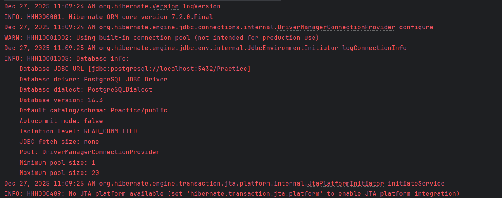
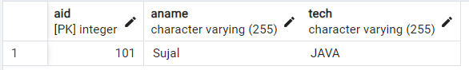

# Hibernate ORM Demo with PostgreSQL

A simple Java application demonstrating how to use **Hibernate ORM** with **PostgreSQL** to persist an entity using annotations and Maven configuration.

---

## 📂 Files

- `Alien.java` – Hibernate entity class mapped using JPA annotations  
- `Main.java` – Application entry point to persist data  
- `pom.xml` – Maven configuration with Hibernate and PostgreSQL dependencies  
- `hibernate.cfg.xml` – Hibernate configuration file (database + dialect)

---

## 🧠 Concept Used

- Object Relational Mapping (ORM)
- Hibernate Core
- JPA Annotations (`@Entity`, `@Id`)
- PostgreSQL Database Connectivity
- Maven Dependency Management
- Hibernate Session & Transaction Lifecycle

---

## 📸 Screenshot
  

---

## 👨‍💻 Author

**Sujal Patil**  
📧 Email: sujalpatil21@gmail.com  
🌐 GitHub: [SujalPatil21](https://github.com/SujalPatil21)
# Hibernate ORM Demo with PostgreSQL
